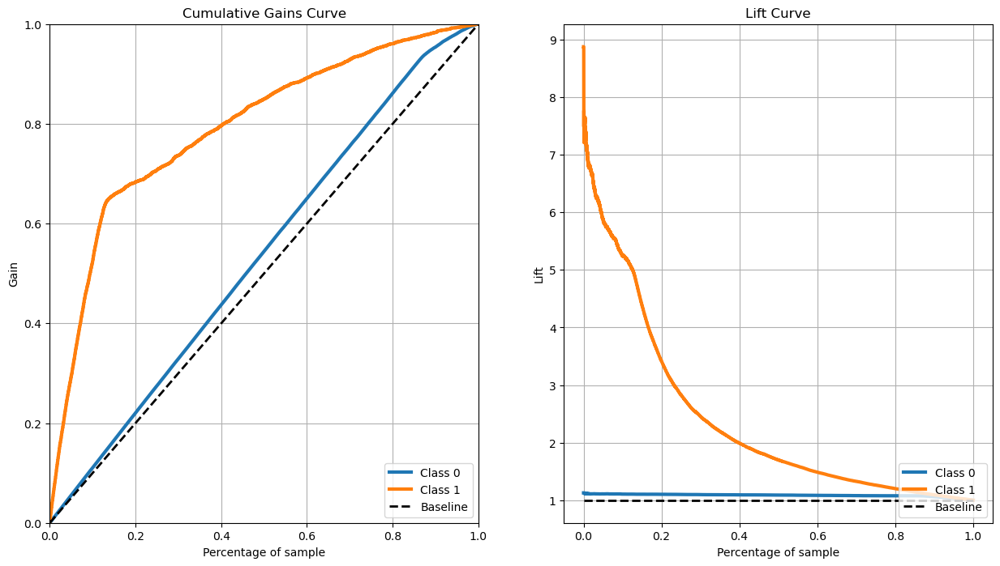

# BH_PCMLAI_17.1

## Assignment 17.1 for Berkeley Haas - Professional Certificate in Machine Learning and Artificial Intelligence

### Notebook
https://github.com/stormrryder/BH_PCMLAI_17.1/blob/main/bank_marketing.ipynb.ipynb

### Objective
- The objective of this analysis is to build a predictive model that can determine if a client will suscribe to a term deposit.
- The model must take into account the client's readily available information to make the prediction.
- Based on the resulting model, provide recommendations on how to best conduct a term deposit marketing campaign.

### The Data
- The dataset collected is related to 17 campaigns that occurred between May 2008 and November 2010, corresponding to a total of 79354 contacts.
- Target variable indicates whether long-term deposition subscription was made.

### Evaluation Criteria
- Lift is the recommended metric to use for performance evaluation. It will be our primary metric. Lift score is the target rate from our predictions vs the target rate of the general population. A model that can find the target clients from the general population will allow to reach them more efficiently (time and resources).
- Precision will be our secondary metric. Precision is the ratio of the actual target clients from all the predicted target clients. As lift, it will indicate if the model can be used to spend resources on the clients that are more likly to accept our offer.
- Lastly we will use the area under curve of the receiver operating curve. The ROC curve compares actual target clients versus incorrely identified target clients. It will also show that our model helps identify the proper clients to contact.

### Models Analysis Summary
- Logistic Regression: The model trains fast and performs within a decent 70% to 80% range.
- KNN: The model trains fast but its performance fails short below 70%.
- Decision Tree: The model trains fast and its performance it in the bottom of the acceptable range 70% or better.
- Support Vector Machine: The model trains slowly but it achieves a near perfect performance. Even if it is slower to train, the cost of preparing the model is significantly less than spending resources spent on reaching out to customers who are unlikely to accept the offer. Therefore the SVC model is the recommended approach.

The graphs show that by using a small percentage of all samples, we can find a much higher number of clients who will accept the offer.

### Next steps
- While the SVC achieved outstanding peformance, it did not do so for every runs. Setting random_state to a specific value did not resolve the non-repeatability issue. It is possibly due to the contructor 'Probability' set to True. The documentation states that a kfold of 5 is used, which may have random shuffling. However, turning this feature off did not remove the unstable nature. This should be investigated further.
- There may be additional data transformations that could be applied to the features to improve the performance of the Logistic Regression model. This could also be further researched. However, due to the near perfect result of the SVC model, it may not be worth doing.

### Recommendations
- For the next marketing campaign, it is recommended to use the SVC model to identify clients most likely to accept the offer. The model performs very well and will reduce the resources required to acheive the desired sale goal.
- The model informed us that a term limit marketing campaign will be more successful when employment variation rate is low (ie negative) and euribor 3 month rate is low. Therefore it would be wise to monitor these economic factors and launch a campaign when the conditions are favorable.
- The data told us that clients respond better on Thursdays and between April and August inclusively. And that a previously positive contact is also key to a successful sale. Therefore sale agents should maximize their contacts during these periods.
